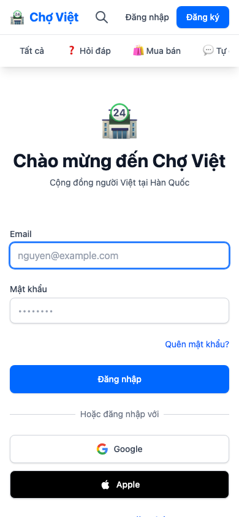
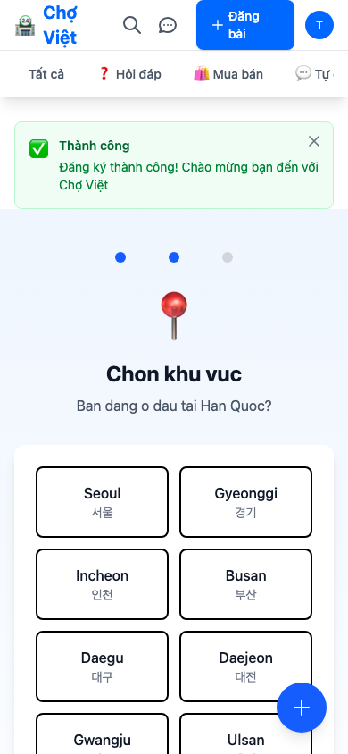

"OAuth? 그거 어려운 거 아니야?"

3개월 전, 누군가 나에게 소셜 로그인을 직접 구현하겠다고 했다면 이렇게 대답했을 것이다.

**"그런 건 전공자들이나 하는 거지."**

40대 중반, 비전공자, 코딩 경력 1년 미만. 나의 스펙이다. OAuth 스펙 문서? 토큰 관리? 콜백 URL? 용어만 들어도 머리가 아팠다.

그런데 오늘, 나는 이 글을 쓰고 있다.

**구글 로그인을 직접 구현했다.**

---

## 포기할 뻔한 순간

Chợ Việt을 만들면서 피드백을 받았다.

> "회원가입이 너무 귀찮아요."

당연한 말이다. 2026년에 이메일 입력하고, 비밀번호 만들고, 확인까지... 누가 이 과정을 거치면서 앱을 쓰겠나.

당근마켓도, 번개장터도 전부 소셜 로그인을 지원한다.

**"나도 해야 하는데..."**

문제는 내가 '해야 한다'고 생각만 했다는 것이다. OAuth 문서를 열었다가 닫고, 유튜브 강의를 틀었다가 끄고. 한 달을 그렇게 보냈다.

솔직히 말하면, **무서웠다**.

내가 할 수 있는 영역이 아니라고 생각했다. 인증이라는 건 보안과 직결되고, 실수하면 사용자 정보가 유출될 수도 있다. 그런 무거운 걸 내가?

---

## 일단 시작했다

어느 날 아침, 이런 생각이 들었다.

> "안 해보고 못한다고 하는 건 비겁한 거 아닌가?"

노트북을 열었다. 구글에 검색했다.

**"Rails Google OAuth 구현"**

그리고 깨달았다. **세상에는 나 같은 사람을 위한 도구가 이미 있다는 것을.**

```ruby
# Gemfile
gem "devise"           # 인증의 90%를 처리해줌
gem "omniauth"         # 소셜 로그인의 공통 인터페이스
gem "omniauth-google-oauth2"  # 구글 전용 어댑터
```

세 줄이었다. 이 세 줄이 내가 두려워했던 것의 대부분을 해결해줬다.

---

## 삽질의 기록

물론 순탄하지만은 않았다.

### 삽질 1: "왜 콜백이 안 오지?"

Google Cloud Console에서 클라이언트를 만들 때, 나는 "데스크톱 앱"을 선택했다. 웹 앱인데 왜 데스크톱을 선택했냐고? 그냥 제일 위에 있어서...

**2시간을 헤맸다.**

교훈: **"웹 애플리케이션"을 선택해야 한다.**

### 삽질 2: "리디렉션 URI가 뭐야?"

```
http://localhost:3000/users/auth/google_oauth2/callback
https://choviet.chat/users/auth/google_oauth2/callback
```

이걸 Google Console에 등록해야 한다는 걸 몰랐다. 로컬에서 되는데 배포하면 안 되고, 배포해서 되는데 로컬에서 안 되고.

**또 2시간.**

교훈: **개발 환경과 운영 환경 URI를 둘 다 등록해야 한다.**

### 삽질 3: "비밀번호가 왜 필요하지?"

소셜 로그인 유저는 비밀번호가 없다. 그런데 Devise가 "비밀번호를 입력하세요"라고 에러를 뱉었다.

```ruby
def password_required?
  provider.blank? && super
end
```

이 세 줄을 찾는 데 **1시간**.

교훈: **에러 메시지를 그대로 검색하면 답이 나온다.**

---

## 결국 완성했다


*로그인 페이지 - Google 버튼이 생겼다*

버튼을 눌렀다. 구글 로그인 창이 떴다. 계정을 선택했다.

**앱에 로그인됐다.**

그 순간, 나는 모니터 앞에서 혼자 웃었다.

"내가 이걸 만들었네."

---

## 온보딩도 만들었다

김에 온보딩 플로우도 추가했다.


*첫 화면 - 베트남어, 한국어, 영어 중 선택*

신규 가입자가 들어오면:
1. 언어를 선택하고
2. 지역을 선택하고
3. 앱 소개를 보고 시작한다

**첫 경험이 달라졌다.**

"이게 뭐하는 앱이지?" 하고 이탈하던 사용자들이 이제는 자연스럽게 설정을 마치고 피드를 본다.

---

## 무엇이 달라졌나

### 기술적으로

- OAuth 2.0의 흐름을 이해하게 됐다
- Devise와 OmniAuth 조합 패턴을 익혔다
- 콜백, 리다이렉션, 토큰 교환이 뭔지 안다

### 마음속으로

**"나도 할 수 있구나"**라는 작은 확신이 생겼다.

3개월 전에는 OAuth 문서만 보면 브라우저를 닫았다. 지금은 새로운 API를 보면 "일단 해볼까?"라는 생각이 먼저 든다.

이게 성장이 아니면 뭘까.

---

## 당신에게

이 글을 읽는 당신은 어떤 것 앞에서 멈춰 서 있는가?

- "그건 내 영역이 아니야"
- "나이가 너무 많아"
- "전공자가 아니라서"

나도 그랬다. 그리고 그 핑계들이 전부 **거짓말**이었다는 걸 알게 됐다.

할 수 없는 게 아니라, **아직 안 해본 것**뿐이었다.

당신도 할 수 있다.

일단 시작해보라.

---

## 다음 이야기

- [ ] Apple 로그인 구현기
- [ ] 카카오 로그인 - 공식 gem이 없으면? 직접 만든다

---

*이 글은 [혼자서 앱 만들기] 시리즈의 6번째 글입니다.*
*Chợ Việt: 한국의 베트남 커뮤니티를 위한 중고거래 앱*
